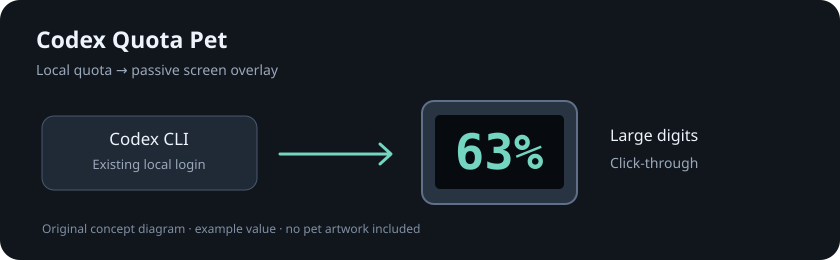

# Codex Quota Pet

[中文](README.md)

Display remaining Codex quota as large digits inside the **Null Signal** pet's face screen. The overlay follows the pet and allows mouse input through; its window uses non-activating, non-focusable settings. Unsupported or uncertain animation frames show the original pet instead. See [compatibility](docs/compatibility.md) for the actual validation scope.

This is an unofficial project, not affiliated with or endorsed by OpenAI. The current `main` source version is **1.3.0**, which adds reset-time hover tips; the [published v1.2.0 release](https://github.com/357749948/codex-quota-pet/releases/tag/v1.2.0) does not include them. Both require a local build. The repository includes no Codex pet artwork, recognition templates, or application binaries.



## Requirements

- Windows x64, Windows PowerShell 5.1, and .NET Framework 4.8 with the built-in x64 Framework C# compiler. No .NET SDK is required.
- An installed Codex desktop app displaying the **Null Signal** pet. See [compatibility](docs/compatibility.md); other pets are unsupported.
- A native `codex.exe` signed in with a ChatGPT account. Quota comes from the **CLI's current account**, which may differ from the desktop account.
- Python **3.13.x x64** for local template generation and development tests. The running application does not need Python.
- Network access to install pinned Python dependencies initially, and working Codex service access for quota reads.

## Build and run

Clone `main` or download its source archive to build 1.3.0 with hover tips. Archives attached to earlier releases still contain their respective versions. Open PowerShell in the repository root:

```powershell
powershell -NoProfile -ExecutionPolicy Bypass -File .\build.ps1
powershell -NoProfile -ExecutionPolicy Bypass -File .\prepare-templates.ps1
powershell -NoProfile -ExecutionPolicy Bypass -File .\test.ps1
Start-Process .\dist\CodexQuotaPet.exe
```

`ExecutionPolicy Bypass` applies only to each command's PowerShell process, without changing system policy. Build output goes to `dist`. The preparation script uses an isolated `.venv`, installs pinned dependencies, reads the local Codex `app.asar`, and creates a local template cache. It does not modify Codex or write original sprite images into the repository.

To override discovery:

```powershell
powershell -NoProfile -ExecutionPolicy Bypass -File .\prepare-templates.ps1 -CodexPath 'C:\path\to\Codex\app.asar' -PythonPath 'C:\path\to\python.exe'
```

`-CodexPath` accepts the desktop install directory, `Codex.exe`, or `app.asar`. `-PythonPath` selects Python 3.13 x64; the default tries `py -3.13`, then `python`. `-SkipDependencyInstall` requires an existing virtual environment with the exact pinned versions.

CLI discovery first checks `CODEX_QUOTA_PET_CODEX_PATH`, then PATH, then known installation locations. Set the override to the native **CLI executable**, not the desktop app:

```powershell
$env:CODEX_QUOTA_PET_CODEX_PATH = 'C:\path\to\codex.exe'
Start-Process .\dist\CodexQuotaPet.exe
```

For login startup, set the override as a Windows user environment variable if needed.

## Install and uninstall

```powershell
# Install and run; a new installation does not enable login startup
powershell -NoProfile -ExecutionPolicy Bypass -File .\scripts\Install.ps1

# Explicitly enable login startup
powershell -NoProfile -ExecutionPolicy Bypass -File .\scripts\Install.ps1 -AutoStart

# Uninstall
powershell -NoProfile -ExecutionPolicy Bypass -File .\scripts\Uninstall.ps1
```

The installer reads `dist` by default; `-SourceDirectory` selects another build directory. `-NoLaunch` installs without running. Upgrades preserve the existing startup choice; `-AutoStart` enables it. Exit a portable copy from its tray before installing. Only one overlay instance runs per Windows session.

Installation uses `%LOCALAPPDATA%\CodexQuotaPet`, without administrator access. Diagnostics and templates use the separate `%LOCALAPPDATA%\CodexQuotaPetData` directory. Uninstall removes owned installed files and its startup shortcut, preserves that data directory and unknown user files, and does not change Codex login or configuration. Installation leaves conflicting unowned paths, links, or shortcuts intact with an error.

## Behavior

- The screen shows one percentage, preferring the weekly window. Hover over the quota digits for about **300 milliseconds** to see a “Next reset (Beijing time)” tip listing each returned quota period and reset time. The tray also provides these details.
- The tip uses a dark rounded background and light text, with width fitted to its content and equal left/right padding. It prefers a position above the pet, then tries its sides or below. It stays within the monitor work area and avoids the pet; if no position fits, it stays hidden. It allows mouse input through and does not activate or take focus. Moving away or pressing a mouse button hides it; releasing starts a new hover delay.
- A hover remembers the original digit region, so the pet's own jumping or turning animation does not repeatedly dismiss the tip. Brief recognition gaps receive up to 750 milliseconds of grace; sustained recognition loss, a hidden pet or a locked desktop still dismiss it.
- Hovering uses the existing quota snapshot without extra requests. Missing reset times show “Unavailable”; elapsed reset times show “Waiting for update.” Stale, offline, and expired-login data show their status rather than presenting an old time as the next reset.
- Remaining quota is `100 - usedPercent`, clamped to 0–100. Colors are teal, amber at ≤30%, and red at ≤10%.
- Reads immediately on appearance, every 30 seconds while visible, and on quota events. Hidden pets pause periodic reads. Appearance, resume, or manual refresh triggers another read. Server statistics can lag.
- Missing values are not zero. At 90 seconds without success, the screen shows `--` and the tray marks data stale; at 5 minutes it marks the connection offline. Expired login has a separate status.
- Requests time out after 15 seconds. Failure retries back off to a maximum 5-minute interval. Reset time triggers a read, never an assumed 100% balance.
- The overlay and tip hide when the pet is hidden, the desktop is locked, the animation is unsupported, or recognition is uncertain. Screen-region capture pauses while locked. The UI is Chinese; all displayed times use Beijing time (UTC+8).

Right-click the tray icon to refresh, inspect details, or quit. Windows may place it in the hidden-icons area.

## Templates and Codex updates

Templates are generated only on the user's computer under `%LOCALAPPDATA%\CodexQuotaPetData\cache`. They record the asset fingerprint, generator version, and format version. Only the tested Null Signal fingerprint is supported; the same pet name does not imply compatibility with every Codex build.

If a Codex update causes a missing/mismatched-template status, run `prepare-templates.ps1`. The overlay reloads the cache automatically; restarting it is also fine. An unknown asset requires a compatibility update. Do not override fingerprint checks or reuse an incompatible template.

The [MIT license](LICENSE) covers this project's own code and documentation. It does not grant redistribution rights to Codex artwork or locally derived data. Do not upload local templates, sprite images, or screenshots containing that artwork. See [third-party notices](docs/third-party-notices.md).

## Tests and feedback

`test.ps1` runs offline synthetic-image, mock-protocol, and program-logic tests by default, without reading a real account. Optional local checks:

```powershell
# Read quota for the CLI's actual signed-in account
powershell -NoProfile -ExecutionPolicy Bypass -File .\test.ps1 -Live

# Inspect the pet node on the current interactive desktop
powershell -NoProfile -ExecutionPolicy Bypass -File .\test.ps1 -DesktopProbe
```

These checks do not replace hovering, dragging, hiding, lock/unlock, or mixed-DPI desktop validation. Hover validation should compare both returned reset times and confirm animation, pet clicks, and typing focus remain correct while the tip is visible. See [compatibility](docs/compatibility.md) for recorded results and limits.

Pet-region images stay in memory; the app does not save or upload screenshots. The local Codex process performs quota requests. There is no project-operated server or telemetry. Local diagnostics still include quota, timestamps, and window positions; review them before sharing. See [data handling](docs/privacy.md).

Reports should include project, Windows, and Codex versions, display scaling, and a short redacted error. Do not submit login files, tokens, templates, or private desktop screenshots. See [contributing](CONTRIBUTING.md) and [security reporting](SECURITY.md).
