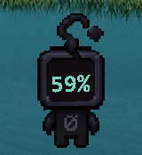

# Codex Quota Pet

[English](README.en.md)

在 Codex 的 **Null Signal** 宠物脸部屏幕中显示剩余额度，用清晰的大字百分比覆盖原来的文字。显示层跟随宠物，鼠标可穿透，窗口按不激活、不获取键盘焦点的方式创建；难以可靠识别的动画帧会恢复原画面。实际验证范围见[兼容性记录](docs/compatibility.md)。

这是非 OpenAI 官方项目，与 OpenAI 无隶属或背书关系。当前 `main` 源码版本为 **1.4.0**，包含悬停查看周期重置时间、可用重置次数及逐条到期时间，保持每分钟刷新；[已发布的 v1.2.0](https://github.com/357749948/codex-quota-pet/releases/tag/v1.2.0) 不含这些更新。两者均需自行构建；仓库不分发从 Codex 提取的素材原图、识别模板或可执行文件。

## 实际效果

<table>
  <tr>
    <th>大字剩余额度</th>
    <th>悬停提示框特写</th>
  </tr>
  <tr>
    <td align="center"></td>
    <td align="center"></td>
  </tr>
</table>

两张截图分别来自早期版本的桌面验收：左图展示大字额度，右图展示悬停提示框，尚未包含 1.4.0 新增的可用重置次数及到期时间。额度与重置时间仅代表各自拍摄时的状态，不是查看者的当前账户数据。截图中的 Codex 界面和宠物美术不属于本项目的 MIT 许可范围，详见[素材说明](docs/third-party-notices.md)。另可查看[原创功能示意图](docs/overview.svg)。

## 环境要求

- Windows x64、Windows PowerShell 5.1、.NET Framework 4.8，使用系统自带的 x64 Framework C# 编译器。无需 .NET SDK。
- 本机已安装 Codex 桌面应用，并显示 **Null Signal** 宠物；支持范围见[兼容性记录](docs/compatibility.md)。其他宠物暂不支持。
- 可用的原生 `codex.exe`，已使用 ChatGPT 账户登录。读取的是 **CLI 当前登录账户**，它可能与桌面应用账户不同，请自行核对。
- Python **3.13.x x64**，仅用于首次生成本机识别模板和开发测试。日常运行不需要 Python。
- 首次准备模板需要网络下载固定版本的 Python 依赖。额度查询需要 Codex 能连接服务。

## 从源码运行

克隆仓库的 `main` 分支或下载该分支的源码归档，可构建含重置次数及到期时间提示的 1.4.0；旧版本 Release 中的归档仍对应其发布版本。在仓库根目录打开 PowerShell。以下命令的 `ExecutionPolicy Bypass` 只作用于该次 PowerShell 进程，不修改系统策略。

```powershell
powershell -NoProfile -ExecutionPolicy Bypass -File .\build.ps1
powershell -NoProfile -ExecutionPolicy Bypass -File .\prepare-templates.ps1
powershell -NoProfile -ExecutionPolicy Bypass -File .\test.ps1
Start-Process .\dist\CodexQuotaPet.exe
```

构建结果位于 `dist`。准备脚本在仓库的 `.venv` 中安装固定依赖，从本机 Codex 的 `app.asar` 只读加载素材，在当前用户本地缓存中生成模板，不修改 Codex，也不将素材原图写入仓库。

若自动发现失败，可显式选择安装位置及 Python：

```powershell
powershell -NoProfile -ExecutionPolicy Bypass -File .\prepare-templates.ps1 -CodexPath 'C:\path\to\Codex\app.asar' -PythonPath 'C:\path\to\python.exe'
```

`-CodexPath` 接受桌面安装目录、`Codex.exe` 或 `app.asar`。`-PythonPath` 必须指向 Python 3.13 x64；默认先查找 `py -3.13`，再查找 `python`。已有版本完全匹配的虚拟环境时，可添加 `-SkipDependencyInstall` 跳过安装依赖。

程序优先读取环境变量 `CODEX_QUOTA_PET_CODEX_PATH` 指定的原生 `codex.exe`，其次检查 PATH，最后检查已知安装位置。此变量指定的是**命令行程序**，不是桌面 `Codex.exe`。可在启动前为当前终端设置：

```powershell
$env:CODEX_QUOTA_PET_CODEX_PATH = 'C:\path\to\codex.exe'
Start-Process .\dist\CodexQuotaPet.exe
```

需要登录启动也使用该路径时，将它设置为 Windows 当前用户的环境变量。

## 安装、启动与卸载

从仓库根目录运行：

```powershell
# 安装到当前用户目录并运行；新安装默认不添加登录启动
powershell -NoProfile -ExecutionPolicy Bypass -File .\scripts\Install.ps1

# 需要登录启动时显式开启
powershell -NoProfile -ExecutionPolicy Bypass -File .\scripts\Install.ps1 -AutoStart

# 卸载本程序
powershell -NoProfile -ExecutionPolicy Bypass -File .\scripts\Uninstall.ps1
```

安装默认读取 `dist`，可用 `-SourceDirectory` 指定其他构建目录。`-NoLaunch` 只安装不运行。升级保留已有登录启动选择；`-AutoStart` 可将其开启。使用便携版本时，先从托盘退出，再安装。重复启动不会产生多个显示层。

安装位置是 `%LOCALAPPDATA%\CodexQuotaPet`，无需管理员权限。诊断和模板独立保存在 `%LOCALAPPDATA%\CodexQuotaPetData`。卸载只处理本程序拥有的安装文件和启动项，保留本地数据目录及不认识的用户文件，不修改 Codex 登录或配置。安装检测到不属于本程序的同名目录、链接或快捷方式时会停止并提示。

## 显示与刷新规则

- 屏幕显示一个百分比，优先显示周额度。鼠标停留在额度数字上约 **300 毫秒**，显示“下次重置（北京时间）”提示，列出实际返回的各个周期及其重置时间；也可在系统托盘查看。
- 周期重置时间下方显示“可用重置：N 次”及可用明细的逐条到期时间，按到期先后排列，长期有效的放最后；次数与时间加粗，跨年时显示年份。次数为零时不显示明细。本程序只能查看，不提供消耗重置次数的操作。
- 次数以服务器为准，不按明细数量推算。仅显示状态为 `available` 的明细；到期时间明确为 `null` 时显示“长期有效”，缺失或异常时显示“到期时间暂不可用”。部分明细会标注“仅返回 X / N 项到期明细”；未返回明细时显示“到期时间暂不可用”。
- 提示使用深灰圆角底和清晰的浅色文字，宽度随内容调整，左右留出一致边距；优先放在宠物上方，空间不足时尝试侧面或下方。提示避开宠物且不超出屏幕工作区；无合适位置时隐藏。它不抢焦点，鼠标可穿透；移开鼠标或按下鼠标键时隐藏，松开后重新计算悬停时间。
- 悬停期间记住最初的数字区域，宠物因鼠标靠近而跳动、转身时不会反复收起提示。短暂识别空隙最多保留 750 毫秒；持续识别失败、宠物隐藏或锁屏仍会收起提示。
- 悬停使用已有额度数据，不额外发起查询。缺失重置时间显示“暂不可用”，到达重置时刻显示“等待更新”；数据待更新、离线或登录失效时显示对应状态，不把旧时间当作下一次重置。
- 剩余比例为 `100 - usedPercent`，限制在 0–100。额度充足时为青绿色，≤30% 为琥珀色，≤10% 为红色。
- 首次显示立即查询，之后每 60 秒通过本机 `account/rateLimits/read` 查询额度和重置明细；收到额度事件时更新额度，不刷新重置次数的读取时间，也不推迟完整查询。宠物隐藏时暂停周期查询，重新出现、唤醒或点击托盘“立即刷新”时再次查询。服务器统计可能有延迟。
- 重置次数单独判断新鲜程度：旧版 Codex 不支持或字段不可用时显示“暂不可用”，超过 90 秒未成功更新显示“待更新”，达到 5 分钟显示“离线”，不继续展示旧到期明细。账户切换或登录失效会清除旧次数和明细；此部分不可用不影响正常额度显示。到达某项到期时刻只触发一次立即查询，显示“已到期，等待更新”，不自行扣减次数。
- 缺失数据不当作零。超过 90 秒未成功更新显示 `--`，托盘提示“待更新”；达到 5 分钟提示“离线”。登录失效时提示重新登录。
- 请求 15 秒超时，失败逐步延长重试，最长间隔 5 分钟。达到重置时间会重新查询，不自行把额度改成 100%。
- 宠物不可见、屏幕锁定、动画角度不支持或识别不可靠时隐藏覆盖层及提示。锁屏期间停止宠物区域读取。中文界面，时间统一为北京时间。

托盘图标可能位于 Windows 的隐藏图标区域。右键可刷新、查看详情或退出。

## 模板与更新

识别模板仅在本机生成，缓存位于 `%LOCALAPPDATA%\CodexQuotaPetData\cache`。模板包含素材指纹、生成器版本和格式版本。当前只支持已验证的 Null Signal 素材指纹；**相同宠物名称并不意味着任意 Codex 版本都兼容**。

Codex 更新后若提示模板缺失或不匹配，重新执行 `prepare-templates.ps1`。显示层会自动重新读取缓存，也可以退出后重启。如果生成器提示素材未支持，需要等待兼容性更新；不要强行修改指纹或继续使用旧模板。

本项目只对自己编写的代码和文档提供 [MIT 许可](LICENSE)，不为截图中的 Codex 界面、宠物美术、原素材或本机派生数据授予再分发许可。请不要上传本机模板、提取的素材或带有原画的测试附件。文档效果截图与运行时素材分开管理，详见[依赖与素材说明](docs/third-party-notices.md)。

## 测试与问题反馈

`test.ps1` 默认离线运行合成图像、模拟协议和程序逻辑测试，不读取真实账户。需显式选择的本机检查：

```powershell
# 读取 CLI 当前账户的真实额度
powershell -NoProfile -ExecutionPolicy Bypass -File .\test.ps1 -Live

# 检查当前交互桌面中的宠物节点
powershell -NoProfile -ExecutionPolicy Bypass -File .\test.ps1 -DesktopProbe
```

这些检查不能替代实际悬停、拖动、隐藏、锁屏恢复和不同缩放的交互验收。悬停验收应核对返回的周期时间、可用重置次数和每条到期时间，并确认提示显示时动画、宠物点击及键盘焦点正常。新增明细后仍需完整容纳提示；空间不足时隐藏，不缩小文字或截断。已验证项和限制见[兼容性记录](docs/compatibility.md)。

程序只在内存中读取宠物所在屏幕区域，不保存或上传截图。上方的效果截图为单独准备的文档素材，并非程序自动生成或上传。额度和重置次数由本机 Codex 子进程读取，不直接读取登录文件，也不新增 HTTP 客户端或外部依赖，没有本项目运营的后台或遥测服务。本地诊断含额度、次数、到期时间和窗口位置，分享前应检查脱敏。详见[数据处理说明](docs/privacy.md)。

报告问题时提供项目版本、Windows/Codex 版本、缩放比例及简短错误信息；不要提交登录文件、令牌、模板或私人桌面截图。开发与贡献见 [CONTRIBUTING](CONTRIBUTING.md)，安全问题见 [SECURITY](SECURITY.md)。
